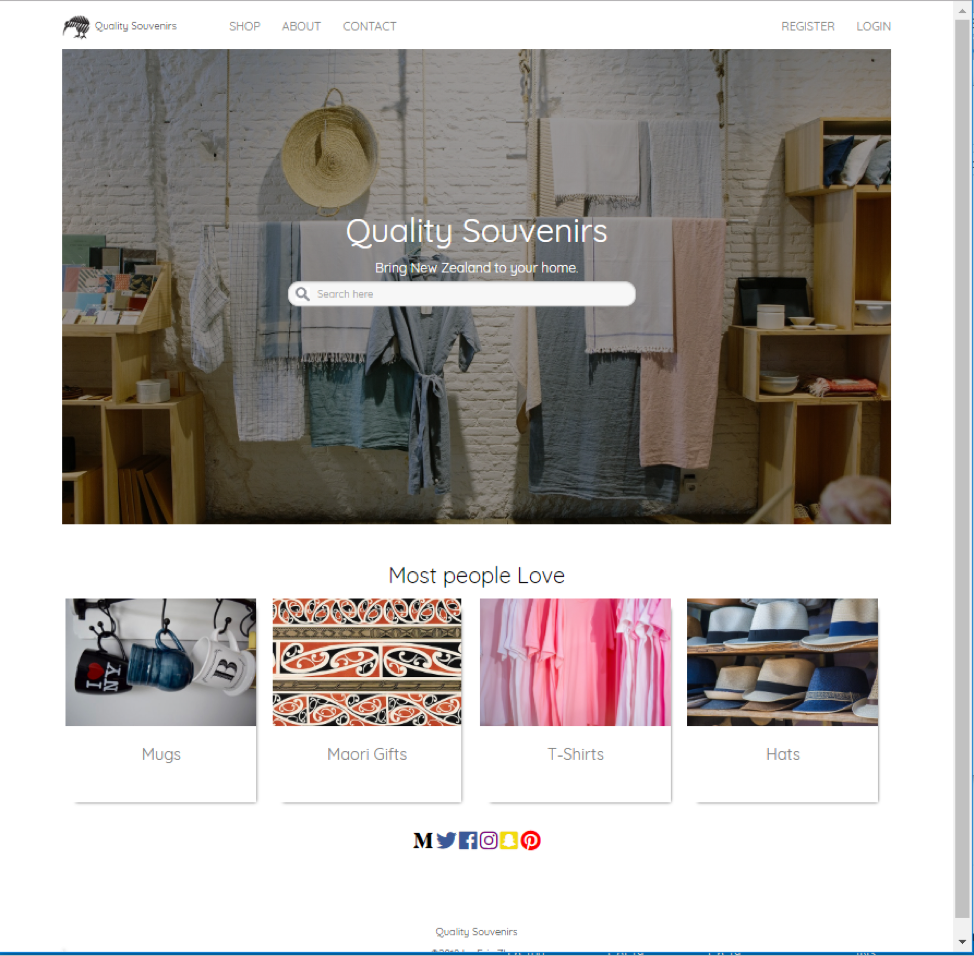
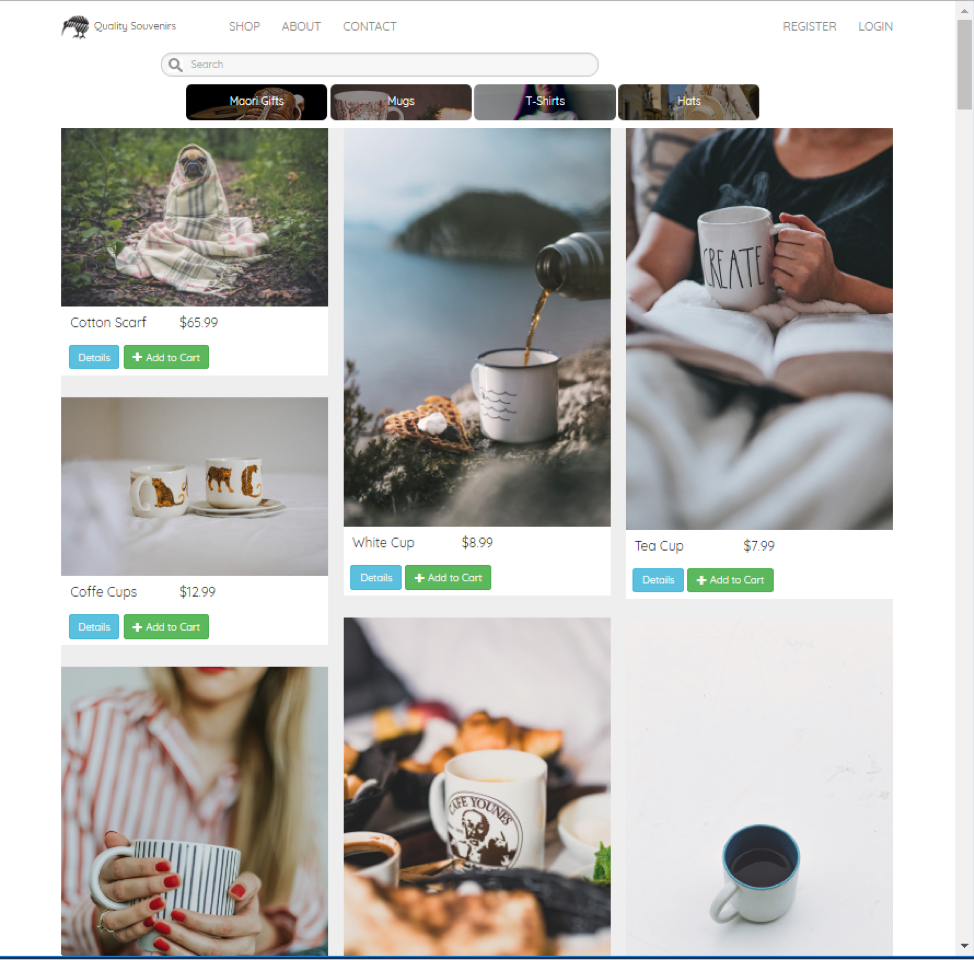

# Quality-Souvenirs-Laravel

An e-commerce website with waterfall style developed with PHP Laravel

Home Page:


Product Page:


# How to

The project uses MySQL docker as database for development. To view the full functionality, it is recommended to install MySQL docker image: mysql-57-centos7.

Another way is to use your own database and change the database connection config in .env file.

After connecting to the database, make data migration with command:

```
php artisan migrate
```
Then start the server with command:

``
php artisan serve
``
